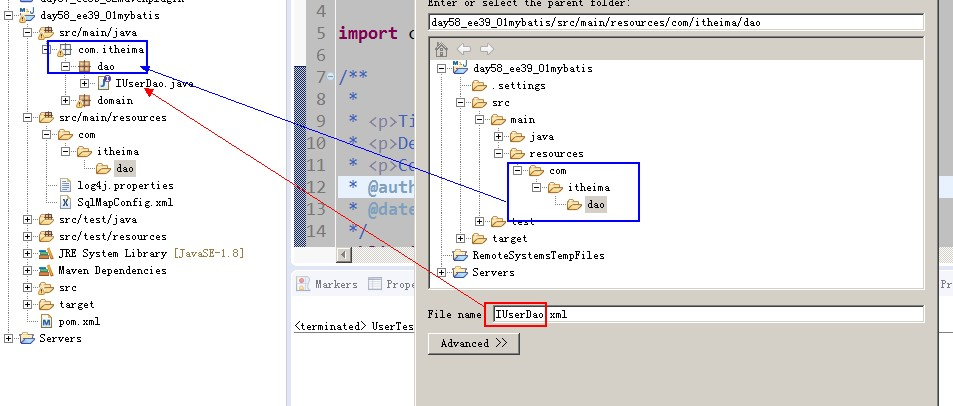
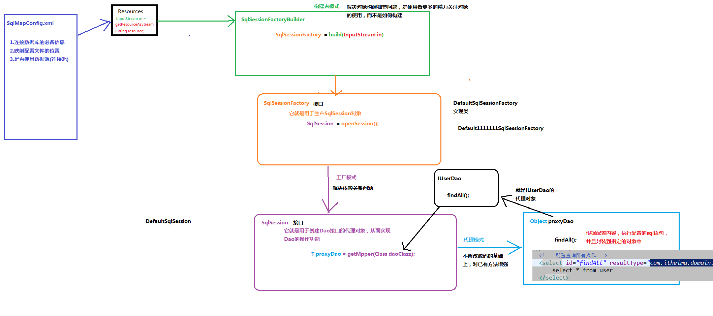

# 第1天：MyBatis入门和环境搭建

## 常见的持久层框架

## MyBatis在MVC体系中的位置


## mapper配置文件的创建要求


## MyBatis的工作原理


## 入门案例的分析
```text
5、mybatis的入门
	mybatis的环境搭建
		第一步：创建maven工程并导入坐标
		第二步：创建实体类和dao的接口
		第三步：创建Mybatis的主配置文件
				SqlMapConifg.xml
		第四步：创建映射配置文件
				IUserDao.xml
	环境搭建的注意事项：
		第一个：创建IUserDao.xml 和 IUserDao.java时名称是为了和我们之前的知识保持一致。
			在Mybatis中它把持久层的操作接口名称和映射文件也叫做：Mapper
			所以：IUserDao 和 IUserMapper是一样的
		第二个：在idea中创建目录的时候，它和包是不一样的
			包在创建时：com.itheima.dao它是三级结构
			目录在创建时：com.itheima.dao是一级目录
		第三个：mybatis的映射配置文件位置必须和dao接口的包结构相同
		第四个：映射配置文件的mapper标签namespace属性的取值必须是dao接口的全限定类名
		第五个：映射配置文件的操作配置（select），id属性的取值必须是dao接口的方法名

		当我们遵从了第三，四，五点之后，我们在开发中就无须再写dao的实现类。
	mybatis的入门案例
		第一步：读取配置文件
		第二步：创建SqlSessionFactory工厂
		第三步：创建SqlSession
		第四步：创建Dao接口的代理对象
		第五步：执行dao中的方法
		第六步：释放资源

		注意事项：
			不要忘记在映射配置中告知mybatis要封装到哪个实体类中
			配置的方式：指定实体类的全限定类名
		
		mybatis基于注解的入门案例：
			把IUserDao.xml移除，在dao接口的方法上使用@Select注解，并且指定SQL语句
			同时需要在SqlMapConfig.xml中的mapper配置时，使用class属性指定dao接口的全限定类名。
	明确：
		我们在实际开发中，都是越简便越好，所以都是采用不写dao实现类的方式。
		不管使用XML还是注解配置。
		但是Mybatis它是支持写dao实现类的。
```


## findAll()方法的执行流程


## 如何定义自己的方法


## 创建MyBatis工程时的注意事项