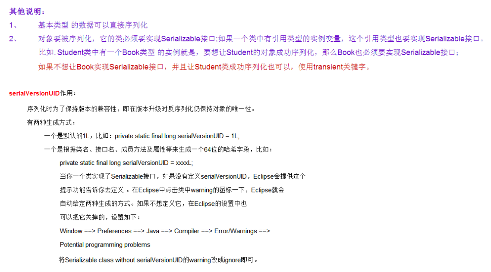

# 09_IO_NIO_序列化等

## 一、填空题

## 二、判断题

## 三、单选题

## 四、多选题
### 1.character流和byte流的区别不包括（`ABD`）
+ A.每次读入的字节数不同
+ B.前者带有缓冲，后者没有。
+ C.前者是字符读入，后者是字节读入。
+ D.二者没有区别，可以互换

> 解答：https://www.nowcoder.com/profile/934336/myFollowings/detail/12741533

字符流和字节流每次读入的字节数是不确定的，可能相同也可能不相同；字符流和字节流都有缓冲流
例如：
+ FileInputStream 的read() 方法每次读入一个字节，read(byte b[]) 每次读入b.length个字节
+ FileReader的read()方法每次读入一个字符，read(char cbuf[], int offset, int length)每次读入length个字符
+ 另外，字符流和字节流读入一个ASCII字符，字节数是相同的


Java的流操作分为字节流和字符流两种。

字节流与字符流主要的区别是他们的处理方式

字节流是最基本的，所有的InputStream和OutputStream的子类都是,主要用在处理二进制数据，它是按字节来处理的。但实际中很多的数据是文本，又提出了字符流的概念，它是按虚拟机的encode来处理，也就是要进行字符集的转化

这两个之间通过 InputStreamReader,OutputStreamWriter来关联，实际上是通过byte[]和String来关联。

在实际开发中出现的汉字问题实际上都是在字符流和字节流之间转化不统一而造成的。
字节流---->字符流
字节流转化为字符流，实际上就是byte[]转化为String时，
public String(byte bytes[], String charsetName)
有一个关键的参数字符集编码，通常我们都省略了，那系统就用操作系统的lang
字符流---->字节流

```
字符流转化为字节流，实际上是String转化为byte[]时，byte[] String.getBytes(String charsetName)也是一样的道理至于java.io中还出现了许多其他的流，按主要是为了提高性能和使用方便，如BufferedInputStream,PipedInputStream等
```

常识：

+ 对于GBK编码标准，英文占用1个字节，中文占用2个字节
+ 对于UTF-8编码标准，英文占用1个字节，中文占用3个字节
+ 对于Unicode编码标准，英文中文都是2个字节。这也是为什么叫做unicode

### 2.以下关于对象序列化描述正确的是(`CD`)
+ A.使用FileOutputStream可以将对象进行传输
+ B.使用PrintWriter可以将对象进行传输
+ C.使用transient修饰的变量不会被序列化
+ D.对象序列化的所属类需要实现Serializable接口

> 解答：https://www.nowcoder.com/profile/934336/myFollowings/detail/3794034

 A和B：能够对对象进行传输的貌似只有ObjectOutputStream和ObjectInputStream这些以Object开头的流对象

关于关于序列化的知识：




## 五、问答题