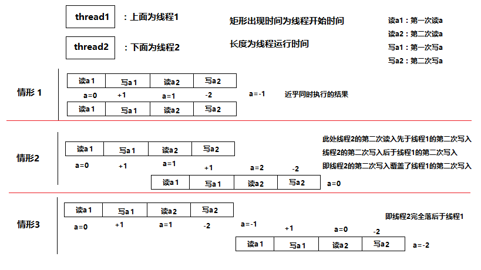

# 10_多线程

## 一、填空题

## 二、判断题

## 三、单选题

## 四、多选题
### 1.下面有关java threadlocal说法正确的有？(`ABCD`)
+ A.ThreadLocal存放的值是线程封闭，线程间互斥的，主要用于线程内共享一些数据，避免通过参数来传递
+ B.从线程的角度看，每个线程都保持一个对其线程局部变量副本的隐式引用，只要线程是活动的并且 ThreadLocal 实例是可访问的；在线程消失之后，其线程局部实例的所有副本都会被垃圾回收
+ C.在Thread类中有一个Map，用于存储每一个线程的变量的副本
+ D.对于多线程资源共享的问题，同步机制采用了“以时间换空间”的方式，而ThreadLocal采用了“以空间换时间”的方式

> 解答：https://www.nowcoder.com/profile/934336/myFollowings/detail/12779934

+ 基本概念：ThreadLocal不是一个线程而是一个线程的本地化对象。当工作于多线程环境中的对象采用ThreadLocal维护变量时，ThreadLocal为每个使用该变量的线程分配一个独立的副本。每个线程都可以独立的改变自己的副本，而不影响其他线程的副本。

+ 原理：ThreadLocal类用于创建一个线程本地变量
在Thread中有一个成员变量ThreadLocals，该变量的类型是ThreadLocalMap,也就是一个Map，它的键是threadLocal，值为就是变量的副本。通过ThreadLocal的get()方法可以获取该线程变量的本地副本，在get方法之前要先set,否则就要重写initialValue()方法。
+ ThreadLocal的使用场景：
  + 数据库连接：在多线程中，如果使用懒汉式的单例模式创建Connection对象，由于该对象是共享的，那么必须要使用同步方法保证线程安全，这样当一个线程在连接数据库时，那么另外一个线程只能等待。这样就造成性能降低。如果改为哪里要连接数据库就来进行连接，那么就会频繁的对数据库进行连接，性能还是不高。这时使用ThreadLocal就可以既可以保证线程安全又可以让性能不会太低。但是ThreadLocal的缺点时占用了较多的空间。

### 2.下列那些方法是线程安全的(所调用的方法都存在)(`ACD`)
+ A.
    ```java
    public class MyServlet implements Servlet {
        public void service(ServletRequest req, ServletResponse resp) {
            BigInteger I = extractFromRequest(req);
            encodeIntoResponse(resp, factors);
        }
    }
    ```
+ B.
    ```java
    public class MyServlet implements Servlet {
        private long count = 0;

        public long getCount() {
            return count;
        }

        public void service(ServletRequest req, ServletResponse resp) {
            BigInteger I = extractFromRequest(req);
            BigInteger[] factors = factor(i);
            count++;
            encodeIntoResponse(resp, factors);
        }
    }
    ```
+ C.
    ```java
    public class MyClass {
        private int value;

        public synchronized int get() {
            return value;
        }

        public synchronized void set(int value) {
            this.value = value;
        }
    }
    ```
+ D.
    ```java
    public class Factorizer implements Servlet {
        private volatile MyCache cache = new MyCache(null, null);

        public void service(ServletRequest req, ServletResponse resp) {
            BigInteger i = extractFromRequest(req);
            BigInteger[] factors = cache.getFactors(i);
            if (factors == null) {
                factors = factor(i);
                cache = new MyCache(i, factors);
            }
            encodeIntoResponse(resp, factors);
        }
    }
    ```

> 解答：https://www.nowcoder.com/profile/934336/myFollowings/detail/12779923

这几个类都没有类属性，不存在共享资源，为了满足题目的意思，应该是多线程情况下使用同一个对象，以达到使成员成为共享资源的目的； 
+ A：没有成员（没有共享资源），线程安全
+ B：假设存在线程1和线程2，count初始值为0，当线程1执行count++中count+1（此时未写回最终计算值），这时线程2执行count++中读取count，发生数据错误，导致线程1线程2的结果都为1，而不是线程1的结果为1，线程2的结果为2，线程不安全； 
+ C：成员私有，对成员的set get方法都加重量级锁，线程安全； 
+ D：volatile有两个作用：可见性（volatile变量的改变能使其他线程立即可见，但它不是线程安全的，参考B）和禁止重排序；这里是可见性的应用，类中方法对volatile修饰的变量只有赋值，线程安全； 欢迎指正。

### 3.下列哪些操作会使线程释放锁资源？(`BC`)
+ A.`sleep()`
+ B.`wait()`
+ C.`join()`
+ D.`yield()`

> 解答：https://www.nowcoder.com/profile/934336/myFollowings/detail/12779921

+ 1.sleep()方法：  
  在指定时间内让当前正在执行的线程暂停执行，但不会释放“锁标志”。不推荐使用。
  
  sleep()使当前线程进入阻塞状态，在指定时间内不会执行。  

+ 2.wait()方法：  
  在其他线程调用对象的notify或notifyAll方法前，导致当前线程等待。线程会释放掉它所占有的“锁标志”，从而使别的线程有机会抢占该锁。  
  
  当前线程必须拥有当前对象锁。如果当前线程不是此锁的拥有者，会抛出IllegalMonitorStateException异常。  
  
  唤醒当前对象锁的等待线程使用notify或notifyAll方法，也必须拥有相同的对象锁，否则也会抛出IllegalMonitorStateException异常。

  waite()和notify()必须在synchronized函数或synchronized　block中进行调用。如果在non-synchronized函数或non-synchronized　block中进行调用，虽然能编译通过，但在运行时会发生IllegalMonitorStateException的异常。

+ 3.join方法  

  等待该线程终止。

  等待调用join方法的线程结束，再继续执行。如：t.join();//主要用于等待t线程运行结束，若无此句，main则会执行完毕，导致结果不可预测。

  join()底层就是调用wait()方法的，wait()释放锁资源，故join也释放锁资源

+ 4.yield方法    
  暂停当前正在执行的线程对象。

  yield()只是使当前线程重新回到可执行状态，所以执行yield()的线程有可能在进入到可执行状态后马上又被执行。

  yield()只能使同优先级或更高优先级的线程有执行的机会。 

### 4.假设`a是一个由线程1和线程2共享的初始值为0的全局变量`，则线程 1 和线程 2 同时执行下面的代码，最终 a 的结果不可能是（`D`）
```java
boolean isOdd = false;

for (int i = 1; i <= 2; ++i) {
    if (i % 2 == 1) isOdd = true;
    else isOdd = false;
    a += i * (isOdd ? 1 : -1); // 这里实际就是+1或者减2
}
```

+ A.-1
+ B.-2
+ C.0
+ D.1

> 解答：https://www.nowcoder.com/profile/934336/myFollowings/detail/12779875

假设两线程为A、B，设有3种情况：
+ 1.AB完全并发：此时读写冲突，相当于只有一个线程对a的读写最终生效。相同于方法只执行了一次。此时a=-1
+ 2.AB部分并发：假设A先进行第一次读写，得到a=1;之后A的读写被B覆盖了。B使用用1作为a的初值，B执行完后a=0
+ 3.AB不并发：此时相当于两个方法顺序执行。A执行完后a=-1，B使用-1作为a的初值，B执行完后a=-2



### 5.下面关于volatile的功能说法正确的是哪个（`BC`）
+ A.原子性
+ B.有序性
+ C.可见性
+ D.持久性

> 解答：https://www.nowcoder.com/profile/934336/myFollowings/detail/12777770

synchronized保证三大性，原子性，有序性，可见性，volatile保证有序性，可见性，不能保证原子性

volatile到底做了什么:

- 禁止了指令重排
- 保证了不同线程对这个变量进行操作时的可见性，即一个线程修改了某个变量值，这个新值对其他线程是立即可见的
- 不保证原子性（线程不安全）

synchronized关键字和volatile关键字比较：

- volatile关键字是线程同步的轻量级实现，所以volatile性能肯定比synchronized关键字要好。但是volatile关键字只能用于变量而synchronized关键字可以修饰方法以及代码块。synchronized关键字在JavaSE1.6之后进行了主要包括为了减少获得锁和释放锁带来的性能消耗而引入的偏向锁和轻量级锁以及其它各种优化之后执行效率有了显著提升，实际开发中使用 synchronized 关键字的场景还是更多一些。
- 多线程访问volatile关键字不会发生阻塞，而synchronized关键字可能会发生阻塞
- volatile关键字能保证数据的可见性，但不能保证数据的原子性。synchronized关键字两者都能保证。
- volatile关键字主要用于解决变量在多个线程之间的可见性，而 synchronized关键字解决的是多个线程之间访问资源的同步性。

### 6.有关线程的哪些叙述是对的（`BCD`）
+ A.一旦一个线程被创建，它就立即开始运行。
+ B.使用start()方法可以使一个线程成为可运行的，但是它不一定立即开始运行。
+ C.当一个线程因为抢先机制而停止运行，它被放在可运行队列的前面。
+ D.一个线程可能因为不同的原因停止并进入就绪状态。

> 解答：https://www.nowcoder.com/profile/934336/myFollowings/detail/12777570

主要是C：个人理解是，这个线程既然是在运行，那么它的优先级应该是线程中最高的，此时因为有了比它优先级更高的其他线程而停止运行，进入可运行队列，当优先级更高的线程运行结束后，它的优先级仍是最高的，所以处于可运行队列的前面

### 7.在Java线程状态转换时，下列转换不可能发生的有（`AC`）？
+ A.初始态->运行态
+ B.就绪态->运行态
+ C.阻塞态->运行态
+ D.运行态->就绪态

> 解答：https://www.nowcoder.com/profile/934336/myFollowings/detail/12777566


### 7.截止JDK1.8版本,java并发框架支持锁包括?（`ABD`）
+ A.读写锁
+ B.自旋锁
+ C.X锁
+ D.乐观锁
+ E.排他锁

> 解答：https://www.nowcoder.com/profile/934336/myFollowings/detail/5361588

+ 1、自旋锁 ,自旋，jvm默认是10次吧，有jvm自己控制。for去争取锁
+ 2、阻塞锁 被阻塞的线程，不会争夺锁。
+ 3、可重入锁 多次进入改锁的域
+ 4、读写锁
+ 5、互斥锁 锁本身就是互斥的
+ 6、悲观锁 不相信，这里会是安全的，必须全部上锁
+ 7、乐观锁 相信，这里是安全的。
+ 8、公平锁 有优先级的锁
+ 9、非公平锁 无优先级的锁
+ 10、偏向锁 无竞争不锁，有竞争挂起，转为轻量锁
+ 11、对象锁 锁住对象
+ 12、线程锁
+ 13、锁粗化 多锁变成一个，自己处理
+ 14、轻量级锁 CAS 实现
+ 15、锁消除 偏向锁就是锁消除的一种
+ 16、锁膨胀 jvm实现，锁粗化
+ 17、信号量 使用阻塞锁 实现的一种策略
+ 18、排它锁：X锁，若事务T对数据对象A加上X锁，则只允许T读取和修改A，其他任何事务都不能再对A加任何类型的锁，直到T释放A上的锁。这就保证了其他事务在T释放A上的锁之前不能再读取和修改A。

## 五、问答题