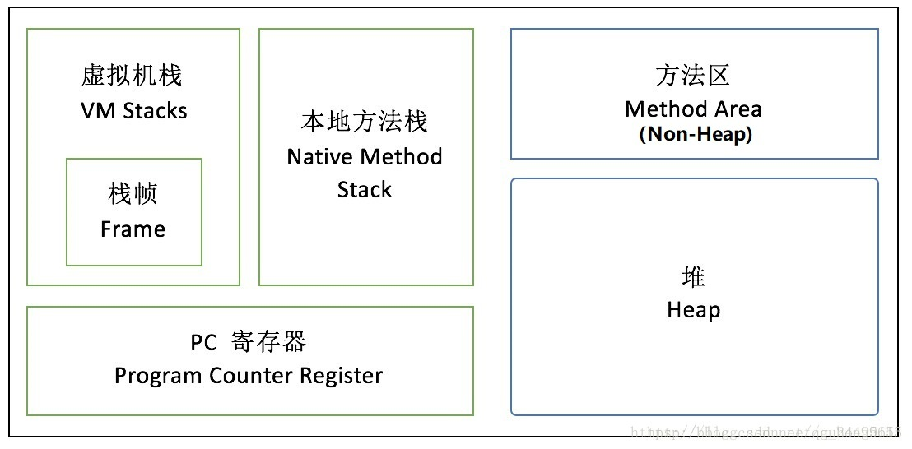

# 13_JVM

## 一、填空题

## 二、判断题

## 三、单选题
### 1.JVM内存不包含如下哪个部分(`D`)
+ A.Stacks
+ B.PC寄存器
+ C.Heap
+ D.Heap Frame

> 解答：https://www.nowcoder.com/profile/934336/myFollowings/detail/12779837

JVM内存五大区域：


### 2.下面关于垃圾收集的描述哪个是错误的？（`D`）
+ A.使用垃圾收集的程序不需要明确释放对象
+ B.现代垃圾收集能够处理循环引用问题
+ C.垃圾收集能提高程序员效率
+ D.使用垃圾收集的语言没有内在泄漏问题

> 解答：https://www.nowcoder.com/profile/934336/myFollowings/detail/12779699

+ A、GC机制可以让开发人员必须要明确何时去释放什么样的对象。虽然有System.gc()，提醒JVM进行一个Full GC，但是到底什么时候执行，都不是人为能控制得。
+ B、GC最常见得问题就是循环引用得问题，对于最常见得引用计数法而言，就没有方法处理这个问题。但是JVM使用得是可达性分析，所以可以处理。
  + 1.引用计数法，给每一个对象上都放一个引用计数器，有引用得时候就+1，失去引用去减1，但是这个样子还是没有办法处理循环引用得问题，所谓得循环引用就是一个类中的属性有其他引用类型，假设一个这个类的某个实例中的某个引用类型的属性指向了某个对象，就算你把这个实例置为null，也还是有引用的。
  + 2.所谓的可达性分析，就是使用一系列可以作为GC Roots的对象作为起点，从这些节点往下搜索，搜索所走过的路径称为引用链，当一个对象到GC Roots没有任何引用链的时候，就证明这个对象不可用。也就是不可达，所以被判定为可回收。
  
  可以作为GC Roots 的对象有：虚拟机栈中引用的对象，方法区的静态属性引用的对象，常量引用的对象和本地方法栈中JNI（Java Native Interface）引用的对象。
再详细的，给一个我博客的链接，可以看看 http://bbblemon.top/2018/04/23/%E6%B7%B1%E5%85%A5%E4%BA%86%E8%A7%A3JVM/
+ C、没毛病吧
+ D、OOM和内存泄露都还是有得,访问资源文件，流不关闭，访问数据库等连接不关闭也是
  + 1. OOM，内存溢出，是说原来得内存不够用了
  + 2. 内存泄漏，说得一个对象没用了，但是不能被回收

### 3.关于java编译和运行命令叙述不正确的是？  (`A`)
+ A.运行“java Scut.class”
+ B.运行“java Scut”
+ C.运行“javac Scut.java”的输出文件是Scut.class
+ D.java这个命令的运行对象是Scut.class

> 解答：https://www.nowcoder.com/profile/934336/myFollowings/detail/12779605

+ A  错误 运行命令是 java + 你的 Java 程序的名字但是不加后缀 所以这道题错在多了 .class这个后缀
+ B  正确
+ C  javac 是编译命令，后跟 你的 Java 程序名字加后缀，也就是 YourClassName.java 所以答案正确
+ D JVM （Java 虚拟机）运行的是编译后的字节码文件（以.class为后缀的文件），也就是 YourClassName.class 所以答案正确

### 4.以下哪个不属于JVM堆内存中的区域（`B`）？
+ A.survivor区
+ B.常量池
+ C.eden区
+ D.old区

> 解答：https://www.nowcoder.com/profile/934336/myFollowings/detail/3793718

jvm堆分为：新生代（一般是一个Eden区，两个Survivor区），老年代（old区）。
常量池属于 PermGen（方法区）

### 5.对于JVM内存配置参数：`-Xmx10240m -Xms10240m -Xmn5120m -XXSurvivorRatio=3`,其最小内存值和Survivor区总大小分别是(`D`)
+ A.5120m，1024m
+ B.5120m，2048m
+ C.10240m，1024m
+ D.10240m，2048m

> 解答：https://www.nowcoder.com/profile/934336/myFollowings/detail/3793396

-Xmx：最大堆大小
-Xms：初始堆大小，即最小内存值
-Xmn:年轻代大小
-XXSurvivorRatio：年轻代中Eden区与Survivor区的大小比值
年轻代5120m， Eden：Survivor=3，Survivor区大小=1024m（Survivor区有两个，即将年轻代分为5份，每个Survivor区占一份），总大小为2048m。
-Xms初始堆大小即最小内存值为10240m

### 6.下面有关java classloader说法错误的是?（`C`）
+ A.Java默认提供的三个ClassLoader是BootStrap ClassLoader，Extension ClassLoader，App ClassLoader
+ B.ClassLoader使用的是双亲委托模型来搜索类的
+ C.JVM在判定两个class是否相同时，只用判断类名相同即可，和类加载器无关
+ D.ClassLoader就是用来动态加载class文件到内存当中用的

解答：https://www.nowcoder.com/profile/934336/myFollowings/detail/3595142

JVM在判定两个class是否相同时，不仅要判断两个类名是否相同，而且要判断是否由同一个类加载器实例加载的。

扩展：
一个jvm中默认的classloader有Bootstrap ClassLoader、Extension ClassLoader、App ClassLoader，分别各司其职：
+ Bootstrap ClassLoader     负责加载java基础类，主要是 %JRE_HOME/lib/ 目录下的rt.jar、resources.jar、charsets.jar和class等
+ Extension ClassLoader      负责加载java扩展类，主要是 %JRE_HOME/lib/ext 目录下的jar和class
+ App ClassLoader           负责加载当前java应用的classpath中的所有类。
classloader 加载类用的是全盘负责委托机制。 什么是双亲委派机制？当某个类加载器需要加载某个.class文件时，它首先把这个任务委托给他的上级类加载器，递归这个操作，如果上级的类加载器没有加载，自己才会去加载这个类。
所以，当我们自定义的classloader加载成功了 com.company.MyClass以后，MyClass里所有依赖的class都由这个classLoader来加载完成。

### 7.假定str0,...,str4后序代码都是只读引用。Java 7中，以上述代码为基础，在发生过一次FullGC后，上述代码在Heap空间（不包括PermGen）保留的字符数为（`C`）
```java
static String str0="0123456789";
static String str1="0123456789";
String str2=str1.substring(5);
String str3=new String(str2);
String str4=new String(str3.toCharArray());
str0=null;
```
+ A.5
+ B.10
+ C.15
+ D.20

> 解答：https://www.nowcoder.com/profile/934336/myFollowings/detail/3513517

substring实际是new，5字符；str3和4也都是new，每个5字符，分别都会创建新的对象；常量池是PermGen的，因此应该是一共15字符

这是一个关于java的垃圾回收机制的题目。垃圾回收主要针对的是堆区的回收，因为栈区的内存是随着线程而释放的。堆区分为三个区：年轻代（Young Generation）、年老代（Old Generation）、永久代（Permanent Generation，也就是方法区）。

+ 年轻代：对象被创建时（new）的对象通常被放在Young（除了一些占据内存比较大的对象）,经过一定的Minor GC（针对年轻代的内存回收）还活着的对象会被移动到年老代（一些具体的移动细节省略）。
+ 年老代：就是上述年轻代移动过来的和一些比较大的对象。Minor GC(FullGC)是针对年老代的回收
+ 永久代：存储的是final常量，static变量，常量池。

str3,str4都是直接new的对象，而substring的源代码其实也是new一个string对象返回，如下图：


经过fullgc之后，年老区的内存回收，则年轻区的占了15个，不算PermGen。所以答案选C

## 四、多选题
### 1.关于运行时常量池，下列哪个说法是正确的？(`BCD`)
+ 运行时常量池大小受栈区大小的影响
+ 运行时常量池大小受方法区大小的影响
+ 存放了编译时期生成的各种字面量
+ 存放编译时期生成的符号引用

> 解读：https://www.nowcoder.com/profile/934336/myFollowings/detail/12779917

运行时常量池（Runtime Constant Pool）是方法区的一部分。Class文件中除了有类的版本、字段、方法、接口等描述信息外，还有一项信息是常量池（Constant Pool Table）,也就是说，每个class都有一个运行时常量池，用于存放编译器生成的各种字面量和符号引用，这部分内容将在类加载后进入方法区的运行时常量池中存放

### 2.判断一块内存空间是否符合垃圾收集器收集的标准有哪些？（`ABD`）
+ A.给对象赋予了空值null,以下再没有调用过
+ B.对象重新分配了内存空间
+ C.给对象赋予了空值null
+ D.给对象赋予了新值

> 解答：https://www.nowcoder.com/profile/934336/myFollowings/detail/12741527

在java语言中，判断一块内存空间是否符合垃圾收集器收集标准的标准只有两个：
+ 1.给对象赋值为null，以下没有调用过。
+ 2.给对象赋了新的值，重新分配了内存空间

### 3.jvm中垃圾回收分为scanvenge gc和full GC，其中full GC触发的条件可能有哪些（`CDE`）
+ A.栈空间满
+ B.年轻代空间满
+ C.老年代满
+ D.持久代满
+ E.System.gc()

> 解答：https://www.nowcoder.com/profile/934336/myFollowings/detail/5366782


+ 1.新生代：
  + （1）所有对象创建在新生代的Eden区，当Eden区满后触发新生代的Minor GC，将Eden区和非空闲Survivor区存活的对象复制到另外一个空闲的Survivor区中。
  + （2）保证一个Survivor区是空的，新生代Minor GC就是在两个Survivor区之间相互复制存活对象，直到Survivor区满为止。
+ 2.老年代：
    当Survivor区也满了之后就通过Minor GC将对象复制到老年代。老年代也满了的话，就将触发Full GC，针对整个堆（包括新生代、老年代、持久代）进行垃圾回收。
+ 3.持久代：
    持久代如果满了，将触发Full GC

### 4.关于OutOfMemoryError，下面说法正确的是（`ABC`）？
+ `java.lang.OutOfMemoryError`: PermGen space 增加-XX:MaxPermSize这个参数的值的话，这个问题通常会得到解决。
+ `java.lang.OutOfMemoryError`: Requested array size exceeds VM limit当你正准备创建一个超过虚拟机允许的大小的数组时，这条错误将会出现
+ `java.lang.OutOfMemoryError`: Java heap space 一般情况下解决这个问题最快的方法就是通过-Xmx参数来增加堆的大小
+ `java.lang.OutOfMemoryError`: nativeGetNewTLA这个异常只有在jRockit虚拟机时才会碰到

> 解答：https://www.nowcoder.com/profile/934336/myFollowings/detail/4010302

关于此题，《深入理解java虚拟机》有关于OOM（OutOfMemory）问题的解释
+ A：属于运行时常量池导致的溢出，设置`-XX：MaxPermSize`可以解决这个问题，
+ B：属于堆空间不足导致的错误，问题比较少见，解决方式和C相同，
+ C：属于java堆内存问题，一般的手段是通过内存映像分析工具，对Dump出来的堆转储存快照进行分析，重点是确认内存中的对象是否是有必要的，也就是要判断是出现了内存泄漏，还是出现了内存溢出，如果是内存列楼，通过工具检查泄露对象打GC Roots的引用链信息，可以准确的确定出泄露代码的位置，不存在泄露，就应该检查虚拟机的堆参数，如果可以继续调大，可以设置-Xmx解决问题
+ D：java.lang.OutOfMemoryError: nativeGetNewTLA指当虚拟机不能分配新的线程本地空间(Thread Local Area）的时候错误信息，此错误是线程申请一个新的TLA时产生的，这个异常一般只会发生在jRockit虚拟机，只有过于绝对。

### 5.以下哪项陈述是正确的？（`E`）
+ A.垃圾回收线程的优先级很高，以保证不再 使用的内存将被及时回收
+ B.垃圾收集允许程序开发者明确指定释放 哪一个对象
+ C.垃圾回收机制保证了JAVA程序不会出现 内存溢出
+ D.进入”Dead”状态的线程将被垃圾回收器回收
+ E.以上都不对

> 解答：https://www.nowcoder.com/profile/934336/myFollowings/detail/3793606

+ A: 垃圾回收在jvm中优先级相当相当低。
+ B：垃圾收集器（GC）程序开发者只能推荐JVM进行回收，但何时回收，回收哪些，程序员不能控制。
+ C：垃圾回收机制只是回收不再使用的JVM内存，如果程序有严重BUG，照样内存溢出。
+ D：进入DEAD的线程，它还可以恢复，GC不会回收
  > 深入理解Java虚拟机 书籍中p66，真正宣布一个对象死亡，至少需要经历2次标记过程。当第一次标记时会同时进行一次筛选(判断此对象是否有必要执行finalize方法)。
  如果对象没有覆盖该方法，就面临死亡，所以说这个方法是对象逃脱死亡命运的最后一次机会。 大家顶我上去，让更多的人看到。看前面没人讲的很详细，如果想深究，去看书。

## 五、问答题

